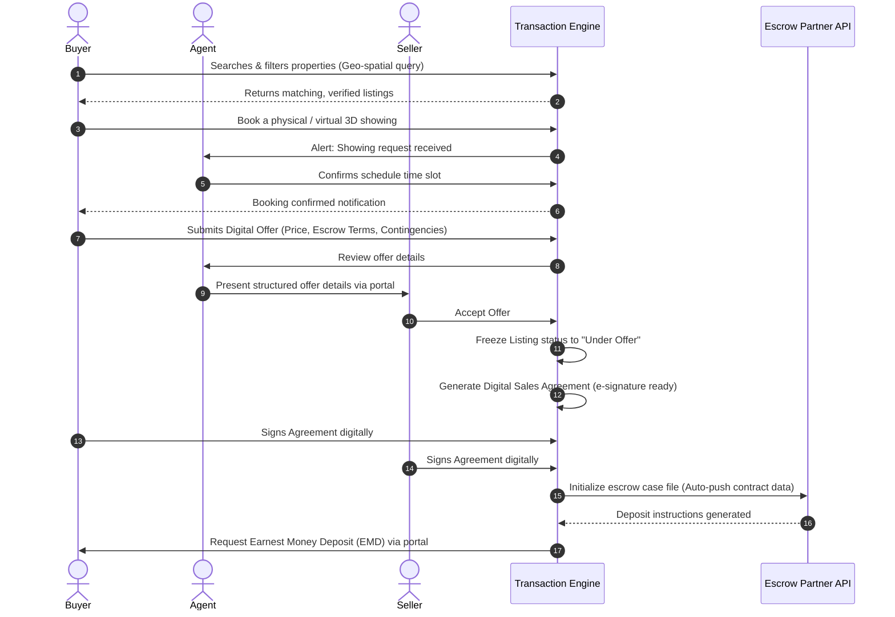
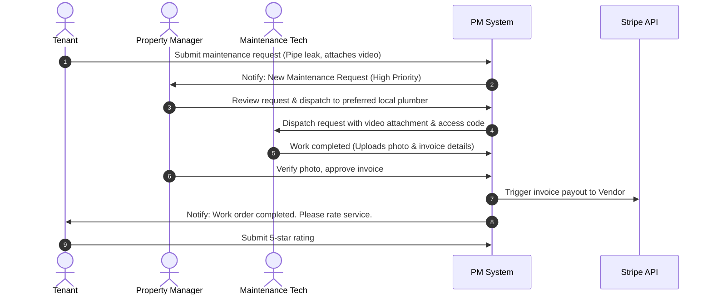
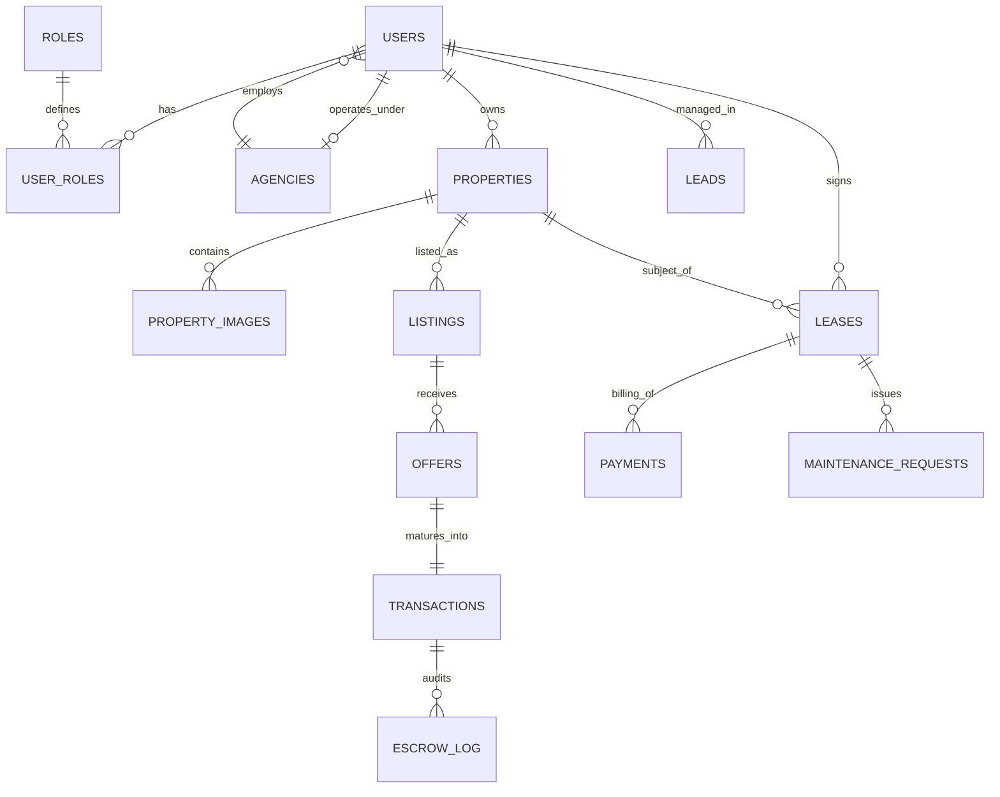
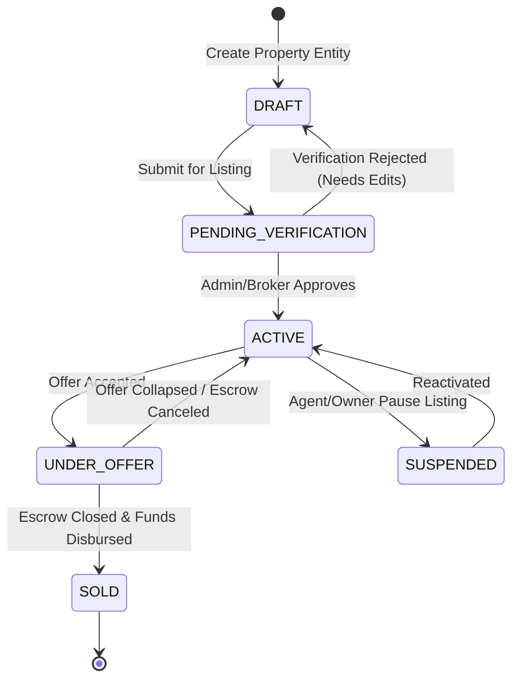

# ENTERPRISE PROPTECH PLATFORM SPECIFICATION
## Global Real Estate Ecosystem & Transaction Engine

---

## 1. Product Requirements Document (PRD)

### 1.1. Executive Summary & Vision
The PropTech platform specified herein is a multi-tenant, SaaS-enabled enterprise real estate ecosystem designed to address the fragmentation, manual overhead, and opacity typical of the global real estate transaction lifecycle. 

Rather than serving as a passive advertising directory, the platform acts as an **end-to-end transaction engine** connecting Buyers, Sellers, Agents, Agencies, Property Managers, and Platform Administrators. The core vision is to digitalize the entire lifecycle of a property—from developer handoff or seller listing, through lead nurturing, legal transaction handling, escrow management, and long-term lease or property management.

### 1.2. Scope of the System
The platform consists of four main operational modules:
1. **Core Listing & Search Engine**: High-performance, geo-spatial, and attribute-based search.
2. **Transaction & Escrow Management**: Digitized offer submission, contract generation, secure signature workflows, and escrow tracking.
3. **Agency CRM & Lead Distribution**: Automated CRM for brokerages, pipeline tracking, and lead routing algorithms.
4. **Property Management & Tenant Portal**: Lease management, online rent payment gateway, and automated maintenance workflow.

### 1.3. Key Business Objectives
* **Reduce Transaction Friction**: Shorten the average real estate transaction closing time from 45 days to under 15 days via automated compliance, e-signatures, and structured document routing.
* **Increase Agent Productivity**: Automate up to 70% of routine client follow-ups and showing scheduling using conversational AI and smart workflows.
* **Global Scale & Localization**: Design for multi-currency, multi-lingual, and variable localized regulatory compliance (e.g., GDPR, CCPA, local escrow rules).

---

## 2. User Types & Personas

| User Type | Platform Interface | Key Responsibilities & Capabilities | Core Goals & Drivers |
| :--- | :--- | :--- | :--- |
| **Buyer** | Consumer Web / Mobile App | Search listings, schedule viewings, submit digital offers, message agents, track escrow. | Find verified properties; secure financing; transparent transaction flow. |
| **Seller** | Consumer Web / Mobile App | Onboard property, view Comparative Market Analysis (CMA), manage offers, sign closing docs. | Maximize sale price; minimize time-on-market; track transaction transparently. |
| **Agent** | Agent CRM Portal / Mobile App | Manage client database, nurture leads, draft contracts, book viewings, track commissions. | Close more deals; automate client follow-ups; maintain regulatory compliance. |
| **Agency (Brokerage)** | Enterprise Dashboard | Manage agent rosters, define commission split templates, view aggregate sales analytics. | Scale brokerage operations; monitor agent performance; secure data isolation. |
| **Property Manager** | Property Manager Console | Manage leases, screen tenants, collect rent payments, dispatch maintenance vendors. | Maintain low vacancy rates; automate rent collection; resolve maintenance issues fast. |
| **Admin** | Admin Panel | Verify and audit listings, moderate disputed content, manage system settings, review flagged users. | Protect platform integrity; resolve system disputes; verify agent credentials. |
| **Super Admin** | Platform Master Console | Global system configurations, monetization/billing settings, database monitoring, RBAC control. | Maintain platform uptime; configure global tenant subscription plans; audit admin activity. |

---

## 3. User Journeys

### Journey A: Buyer Purchase Flow (Search to Escrow)


### Journey B: Seller Property Onboarding & Marketing
1. **Sellers** authenticates via MFA and lands on the Seller Hub.
2. They initiate "Add Property" -> enters physical address -> System queries GIS and tax databases to auto-fill property boundary, parcel details, and structural info.
3. Seller uploads media (high-res images, 3D Matterport walkthrough configuration).
4. System executes an AI media scan to check for quality (detect blurriness) and compliance (ensuring no faces, phone numbers, or license plates are visible).
5. Seller runs the **Automated Valuation Model (AVM)** to view pricing estimates and enters the target listing price.
6. Seller selects a registered Listing Agent or requests the platform to auto-match them with a top-performing local agent based on transaction history in that zip code.
7. Agent reviews listing, amends details, and changes status to `Active`.

### Journey C: Property Management Rent & Maintenance Resolution


---

## 4. Functional Requirements

### 4.1. Core Property & Search Module (F-100)
* **F-101 (Geo-Spatial Search)**: Users must be able to search properties using free-text search, map boundaries (drawing polygons), radius search, and zip code matching.
* **F-102 (Granular Filters)**: Filter criteria must include: transaction type (buy/rent), property type (single-family, condo, commercial, land), price range, bedrooms, bathrooms, square footage, year built, HOA fees, and amenities.
* **F-103 (Matterport & Virtual Tours)**: Platform must embed and render 3D matterport, iframe video walks, and 360-degree interactive photo galleries.

### 4.2. Transaction & Contract Engine (F-200)
* **F-201 (Offer Management)**: Buyers can submit structured digital offers specifying offer price, earnest deposit, financing contingencies, inspection period duration, and expiry date.
* **F-202 (Digital Signature Integration)**: Embedded e-signature capability (DocuSign/HelloSign REST API wrapper) to allow in-platform contract signing for all parties.
* **F-203 (Escrow Tracking)**: A real-time timeline component display detailing: Earnest money deposit status, Home inspection completion, Appraisal status, Loan approval, Title search, and Final closing docs.

### 4.3. CRM & Agent Productivity Module (F-300)
* **F-301 (Lead Assignment Engine)**: Auto-route incoming buyer/seller leads to agents based on geographical specialization, agent workload, and performance scoring.
* **F-302 (Client Interaction Timeline)**: Consolidate client interactions across channels (SMS logs, email threads, property viewings history, and saved properties list) into a single agent view.
* **F-303 (Calendar Sync)**: Native bidirectional sync with Google Calendar and Outlook Calendar for showings, inspections, and closing dates.

### 4.4. Property & Lease Management Module (F-400)
* **F-401 (Tenant Screening)**: Integrated API checks for credit history, background checks, and eviction records (e.g., via TransUnion SmartMove API integration).
* **F-402 (Rent Payment Gateway)**: Tenants can pay rent via ACH or Credit Card using Stripe Billing. Support automated recurring payments, late fee calculation logic, and direct bank payout distribution to owners.
* **F-403 (Maintenance Ticketing)**: Categorized maintenance ticketing with status states: `Submitted`, `Assigned`, `In Progress`, `Vendor Invoiced`, `Completed`, `Closed`.

---

## 5. Non-Functional Requirements

### 5.1. Scalability & Availability
* **Availability**: Target 99.99% uptime for core user-facing operations. Use multi-region active-passive deployment with automated DNS failover (Route 53 latency-based routing).
* **Scalability**: Horizontal pod autoscaling (HPA) in Kubernetes based on CPU and memory usage targets. Read-intensive search traffic offloaded to read-replicas and distributed Redis clusters.

### 5.2. Localization & Global Support
* **Multi-Currency**: Double-entry ledger system architecture supporting multi-currency transactions. Daily automated exchange rate sync with European Central Bank / OpenExchangeRates APIs.
* **Multilingual**: App structure must use i18next or equivalent, storing translation keys for UI elements. Static contents served in localized domains (e.g., `.fr`, `.co.uk`, `.de`).

### 5.3. Maintainability & Code Quality
* **Architecture Style**: Modular Monolith transitioning to Microservices. Clear logical separation of domains: User Auth, Listings search, Transactions, CRM, Property Management, Payments.
* **Linting & Code Standards**: Strict TypeScript compilation, Prettier code styling, and unit test coverage target of >85% for all service files.

---

## 6. Database Architecture

### 6.1. Entity-Relationship Diagram (ERD)



### 6.2. PostgreSQL Schema Definitions (DDL)

```sql
-- Create Enum Types for Status Controls
CREATE TYPE listing_status AS ENUM ('DRAFT', 'PENDING_VERIFICATION', 'ACTIVE', 'UNDER_OFFER', 'SOLD', 'RENTED', 'SUSPENDED', 'ARCHIVED');
CREATE TYPE offer_status AS ENUM ('SUBMITTED', 'COUNTERED', 'ACCEPTED', 'REJECTED', 'EXPIRED', 'WITHDRAWN');
CREATE TYPE transaction_status AS ENUM ('ESCROW_OPENED', 'INSPECTION_PERIOD', 'FINANCING_CONTINGENCY', 'PENDING_SIGNATURES', 'CLOSED', 'FAILED');
CREATE TYPE lease_status AS ENUM ('DRAFT', 'ACTIVE', 'EXPIRED', 'TERMINATED');
CREATE TYPE payment_status AS ENUM ('PENDING', 'PAID', 'FAILED', 'REFUNDED');
CREATE TYPE maintenance_priority AS ENUM ('LOW', 'MEDIUM', 'HIGH', 'EMERGENCY');
CREATE TYPE maintenance_status AS ENUM ('SUBMITTED', 'ASSIGNED', 'IN_PROGRESS', 'COMPLETED', 'CLOSED');

-- 1. ROLES TABLE
CREATE TABLE roles (
    id UUID PRIMARY KEY DEFAULT gen_random_uuid(),
    name VARCHAR(50) UNIQUE NOT NULL,
    description TEXT,
    created_at TIMESTAMP WITH TIME ZONE DEFAULT CURRENT_TIMESTAMP,
    updated_at TIMESTAMP WITH TIME ZONE DEFAULT CURRENT_TIMESTAMP
);

-- 2. AGENCIES TABLE
CREATE TABLE agencies (
    id UUID PRIMARY KEY DEFAULT gen_random_uuid(),
    name VARCHAR(255) NOT NULL,
    license_number VARCHAR(100) UNIQUE NOT NULL,
    logo_url VARCHAR(512),
    address_street VARCHAR(255),
    address_city VARCHAR(100),
    address_state VARCHAR(100),
    address_zip VARCHAR(20),
    address_country VARCHAR(100),
    billing_subscription_tier VARCHAR(50) DEFAULT 'FREE',
    created_at TIMESTAMP WITH TIME ZONE DEFAULT CURRENT_TIMESTAMP,
    updated_at TIMESTAMP WITH TIME ZONE DEFAULT CURRENT_TIMESTAMP
);

-- 3. USERS TABLE
CREATE TABLE users (
    id UUID PRIMARY KEY DEFAULT gen_random_uuid(),
    email VARCHAR(255) UNIQUE NOT NULL,
    password_hash VARCHAR(255) NOT NULL,
    first_name VARCHAR(100) NOT NULL,
    last_name VARCHAR(100) NOT NULL,
    phone_number VARCHAR(50),
    agency_id UUID REFERENCES agencies(id) ON DELETE SET NULL,
    mfa_secret VARCHAR(128),
    is_mfa_enabled BOOLEAN DEFAULT FALSE,
    is_verified BOOLEAN DEFAULT FALSE,
    avatar_url VARCHAR(512),
    created_at TIMESTAMP WITH TIME ZONE DEFAULT CURRENT_TIMESTAMP,
    updated_at TIMESTAMP WITH TIME ZONE DEFAULT CURRENT_TIMESTAMP
);

-- 4. USER_ROLES (M-to-M link)
CREATE TABLE user_roles (
    user_id UUID REFERENCES users(id) ON DELETE CASCADE,
    role_id UUID REFERENCES roles(id) ON DELETE CASCADE,
    PRIMARY KEY (user_id, role_id)
);

-- 5. PROPERTIES TABLE
CREATE TABLE properties (
    id UUID PRIMARY KEY DEFAULT gen_random_uuid(),
    owner_id UUID NOT NULL REFERENCES users(id) ON DELETE RESTRICT,
    title VARCHAR(255) NOT NULL,
    description TEXT NOT NULL,
    property_type VARCHAR(50) NOT NULL, -- CONDO, SINGLE_FAMILY, LAND, COMMERCIAL
    address_street VARCHAR(255) NOT NULL,
    address_city VARCHAR(100) NOT NULL,
    address_state VARCHAR(100) NOT NULL,
    address_zip VARCHAR(20) NOT NULL,
    address_country VARCHAR(100) NOT NULL,
    latitude NUMERIC(10, 8) NOT NULL,
    longitude NUMERIC(11, 8) NOT NULL,
    geo_point POINT NOT NULL, -- Postgres point data type for geospatial indexes
    bedrooms INT,
    bathrooms NUMERIC(3, 1),
    square_footage NUMERIC(10, 2) NOT NULL,
    year_built INT,
    tax_parcel_id VARCHAR(100),
    amenities JSONB DEFAULT '{}'::jsonb, -- Store list of strings, dynamic properties
    created_at TIMESTAMP WITH TIME ZONE DEFAULT CURRENT_TIMESTAMP,
    updated_at TIMESTAMP WITH TIME ZONE DEFAULT CURRENT_TIMESTAMP
);

-- 6. PROPERTY_IMAGES TABLE
CREATE TABLE property_images (
    id UUID PRIMARY KEY DEFAULT gen_random_uuid(),
    property_id UUID REFERENCES properties(id) ON DELETE CASCADE,
    image_url VARCHAR(512) NOT NULL,
    display_order INT DEFAULT 0,
    is_cover BOOLEAN DEFAULT FALSE,
    created_at TIMESTAMP WITH TIME ZONE DEFAULT CURRENT_TIMESTAMP
);

-- 7. LISTINGS TABLE
CREATE TABLE listings (
    id UUID PRIMARY KEY DEFAULT gen_random_uuid(),
    property_id UUID UNIQUE NOT NULL REFERENCES properties(id) ON DELETE CASCADE,
    listing_agent_id UUID REFERENCES users(id) ON DELETE SET NULL,
    agency_id UUID REFERENCES agencies(id) ON DELETE SET NULL,
    price NUMERIC(15, 2) NOT NULL,
    currency VARCHAR(3) DEFAULT 'USD',
    transaction_type VARCHAR(10) CHECK (transaction_type IN ('BUY', 'RENT')),
    status listing_status DEFAULT 'DRAFT',
    listed_date TIMESTAMP WITH TIME ZONE,
    expiry_date TIMESTAMP WITH TIME ZONE,
    created_at TIMESTAMP WITH TIME ZONE DEFAULT CURRENT_TIMESTAMP,
    updated_at TIMESTAMP WITH TIME ZONE DEFAULT CURRENT_TIMESTAMP
);

-- 8. OFFERS TABLE
CREATE TABLE offers (
    id UUID PRIMARY KEY DEFAULT gen_random_uuid(),
    listing_id UUID REFERENCES listings(id) ON DELETE RESTRICT,
    buyer_id UUID REFERENCES users(id) ON DELETE RESTRICT,
    offer_amount NUMERIC(15, 2) NOT NULL,
    earnest_money_amount NUMERIC(15, 2) NOT NULL,
    contingencies TEXT,
    proposed_closing_date DATE NOT NULL,
    status offer_status DEFAULT 'SUBMITTED',
    expiry_time TIMESTAMP WITH TIME ZONE NOT NULL,
    created_at TIMESTAMP WITH TIME ZONE DEFAULT CURRENT_TIMESTAMP,
    updated_at TIMESTAMP WITH TIME ZONE DEFAULT CURRENT_TIMESTAMP
);

-- 9. TRANSACTIONS TABLE
CREATE TABLE transactions (
    id UUID PRIMARY KEY DEFAULT gen_random_uuid(),
    listing_id UUID REFERENCES listings(id) ON DELETE RESTRICT,
    offer_id UUID UNIQUE REFERENCES offers(id) ON DELETE RESTRICT,
    buyer_id UUID REFERENCES users(id) ON DELETE RESTRICT,
    seller_id UUID REFERENCES users(id) ON DELETE RESTRICT,
    agent_id UUID REFERENCES users(id) ON DELETE RESTRICT,
    escrow_account_number VARCHAR(100),
    status transaction_status DEFAULT 'ESCROW_OPENED',
    contract_file_url VARCHAR(512),
    created_at TIMESTAMP WITH TIME ZONE DEFAULT CURRENT_TIMESTAMP,
    updated_at TIMESTAMP WITH TIME ZONE DEFAULT CURRENT_TIMESTAMP
);

-- 10. LEASES (Property Management Domain)
CREATE TABLE leases (
    id UUID PRIMARY KEY DEFAULT gen_random_uuid(),
    property_id UUID REFERENCES properties(id) ON DELETE RESTRICT,
    tenant_id UUID REFERENCES users(id) ON DELETE RESTRICT,
    landlord_id UUID REFERENCES users(id) ON DELETE RESTRICT,
    start_date DATE NOT NULL,
    end_date DATE NOT NULL,
    monthly_rent NUMERIC(12, 2) NOT NULL,
    security_deposit NUMERIC(12, 2) NOT NULL,
    status lease_status DEFAULT 'DRAFT',
    lease_document_url VARCHAR(512),
    created_at TIMESTAMP WITH TIME ZONE DEFAULT CURRENT_TIMESTAMP,
    updated_at TIMESTAMP WITH TIME ZONE DEFAULT CURRENT_TIMESTAMP
);

-- 11. PAYMENTS TABLE
CREATE TABLE payments (
    id UUID PRIMARY KEY DEFAULT gen_random_uuid(),
    lease_id UUID REFERENCES leases(id) ON DELETE RESTRICT,
    payer_id UUID REFERENCES users(id) ON DELETE RESTRICT,
    amount NUMERIC(12, 2) NOT NULL,
    payment_method VARCHAR(50) NOT NULL, -- STRIPE_ACH, STRIPE_CC
    stripe_charge_id VARCHAR(255) UNIQUE,
    status payment_status DEFAULT 'PENDING',
    due_date DATE,
    paid_at TIMESTAMP WITH TIME ZONE,
    created_at TIMESTAMP WITH TIME ZONE DEFAULT CURRENT_TIMESTAMP
);

-- 12. MAINTENANCE_REQUESTS
CREATE TABLE maintenance_requests (
    id UUID PRIMARY KEY DEFAULT gen_random_uuid(),
    lease_id UUID REFERENCES leases(id) ON DELETE CASCADE,
    reporter_id UUID REFERENCES users(id) ON DELETE SET NULL,
    title VARCHAR(255) NOT NULL,
    description TEXT NOT NULL,
    priority maintenance_priority DEFAULT 'MEDIUM',
    status maintenance_status DEFAULT 'SUBMITTED',
    media_urls TEXT[],
    assigned_vendor_id UUID REFERENCES users(id) ON DELETE SET NULL,
    created_at TIMESTAMP WITH TIME ZONE DEFAULT CURRENT_TIMESTAMP,
    updated_at TIMESTAMP WITH TIME ZONE DEFAULT CURRENT_TIMESTAMP
);

-- 13. LEADS (CRM Domain)
CREATE TABLE leads (
    id UUID PRIMARY KEY DEFAULT gen_random_uuid(),
    contact_name VARCHAR(255) NOT NULL,
    contact_email VARCHAR(255) NOT NULL,
    contact_phone VARCHAR(50),
    assigned_agent_id UUID REFERENCES users(id) ON DELETE SET NULL,
    source VARCHAR(100) NOT NULL, -- PORTAL, FACEBOOK_ADS, ZILLOW_FEED
    status VARCHAR(50) DEFAULT 'NEW', -- NEW, CONTACTED, QUALIFIED, LOST, CONVERTED
    notes TEXT,
    created_at TIMESTAMP WITH TIME ZONE DEFAULT CURRENT_TIMESTAMP,
    updated_at TIMESTAMP WITH TIME ZONE DEFAULT CURRENT_TIMESTAMP
);
```

### 6.3. Indexing & Optimization Strategy
1. **Spatial Geospatial Searching**:
   ```sql
   CREATE INDEX idx_properties_coordinates ON properties USING gist (geo_point);
   ```
   *Explanation*: We use GiST indexes over coordinates (`geo_point` mapping latitude/longitude) to allow sub-millisecond bounding box (`&&` operator) and circle-radius distance queries (`<->` operator) for map search.
2. **Full-Text Listing Search**:
   ```sql
   CREATE INDEX idx_properties_fts ON properties USING gin (to_tsvector('english', title || ' ' || description));
   ```
   *Explanation*: Enables high-efficiency structural textual matching without hitting DB bottlenecks or needing external search platforms in the early development phase.
3. **JSONB Amenity Filtering**:
   ```sql
   CREATE INDEX idx_properties_amenities ON properties USING gin (amenities);
   ```
   *Explanation*: Speeds up queries like `WHERE amenities @> '{"has_pool": true, "has_garage": true}'`.
4. **Primary Foreign Key Indices**:
   ```sql
   CREATE INDEX idx_listings_property_id ON listings(property_id);
   CREATE INDEX idx_listings_status ON listings(status);
   CREATE INDEX idx_offers_listing_id ON offers(listing_id);
   CREATE INDEX idx_transactions_offer_id ON transactions(offer_id);
   CREATE INDEX idx_leases_property_id ON leases(property_id);
   CREATE INDEX idx_payments_lease_id ON payments(lease_id);
   CREATE INDEX idx_leads_assigned_agent ON leads(assigned_agent_id);
   ```

---

## 7. Role-Based Access Control (RBAC)

### 7.1. Permission Architecture
We implement granular, resource-based permissions structured as `domain.resource.action`. Row-level checks are handled dynamically using security predicates.

* `listing.create`: Create property records and list properties.
* `listing.update_all`: Force-update any listing metadata (Admin constraint).
* `listing.update_own`: Update listings where user is owner or assigned listing agent.
* `listing.verify`: Approve pending listings to make them active.
* `offer.submit`: Create an offer record.
* `offer.review_agency`: Read offers submitted on properties managed by the user's agency.
* `transaction.sign`: Execute digital signatures on a transaction.
* `billing.manage`: Configure agency subscription plans and transaction fee percentages.

### 7.2. Permission Matrix

| Role | `listing.create` | `listing.update_own` | `listing.verify` | `offer.submit` | `offer.review_agency` | `transaction.sign` | `billing.manage` |
| :--- | :---: | :---: | :---: | :---: | :---: | :---: | :---: |
| **Super Admin** | ✓ | ✓ | ✓ | ✓ | ✓ | ✓ | ✓ |
| **Admin** | ✓ | ✓ | ✓ | - | ✓ | - | - |
| **Agency Broker**| ✓ | ✓ | - | - | ✓ | ✓ | ✓ |
| **Agent** | ✓ | ✓ | - | - | - | ✓ | - |
| **Seller** | ✓ | ✓ | - | - | - | ✓ | - |
| **Buyer** | - | - | - | ✓ | - | ✓ | - |
| **Property Mgr** | - | - | - | - | - | - | - |

### 7.3. Row-Level Security Example (PostgreSQL)
```sql
-- Enable Row Level Security
ALTER TABLE properties ENABLE ROW LEVEL SECURITY;

-- Policy: Owners and assigned Agents can update their own property details
CREATE POLICY update_property_policy ON properties
    FOR UPDATE
    TO authenticated_users
    USING (
        owner_id = current_user_id() 
        OR EXISTS (
            SELECT 1 FROM listings 
            WHERE listings.property_id = properties.id 
              AND listings.listing_agent_id = current_user_id()
        )
    );
```

---

## 8. API Architecture

The platform implements a hybrid API gateway architecture combining **RESTful Endpoints** (for transactional state changes, payments, and file uploads), **GraphQL** (for flexible, client-defined property search queries), and **WebSockets** (for real-time chat, showing availability alerts, and instant notification dispatches).

### 8.1. REST API Endpoint Specifications

#### `POST /api/v1/auth/login`
Authenticates a user and issues JWTs.
* **Headers**: `Content-Type: application/json`
* **Request Body**:
  ```json
  {
    "email": "agent.smith@agencyone.com",
    "password": "Password123#",
    "mfa_token": "123456"
  }
  ```
* **Success Response (200 OK)**:
  ```json
  {
    "status": "success",
    "data": {
      "access_token": "eyJhbGciOi...",
      "refresh_token": "rF2390f...",
      "expires_in": 3600,
      "user": {
        "id": "2d3e528b-b827-4c7a-9a99-b1d56e72b4c1",
        "first_name": "Smith",
        "last_name": "Agent",
        "email": "agent.smith@agencyone.com",
        "roles": ["AGENT"]
      }
    }
  }
  ```

#### `POST /api/v1/properties/{id}/offers`
Submits a digital offer on a property listing.
* **Authentication**: Bearer Token required. Role: `BUYER`
* **URL Parameters**: `id: UUID` (Property/Listing ID)
* **Request Body**:
  ```json
  {
    "offer_amount": 750000.00,
    "earnest_money_amount": 15000.00,
    "contingencies": "Subject to visual inspection and home appraisal within 10 business days.",
    "proposed_closing_date": "2026-08-30"
  }
  ```
* **Success Response (201 Created)**:
  ```json
  {
    "status": "success",
    "data": {
      "offer_id": "f5195d82-df75-4309-a128-4e89793bfad5",
      "listing_id": "97e68228-3e91-4d37-bd92-4ee1fa6a47a1",
      "status": "SUBMITTED",
      "expiry_time": "2026-06-19T22:29:15Z"
    }
  }
  ```

### 8.2. GraphQL Schema for Property Search
```graphql
type Property {
  id: ID!
  title: String!
  description: String!
  propertyType: String!
  addressStreet: String!
  addressCity: String!
  addressState: String!
  addressZip: String!
  latitude: Float!
  longitude: Float!
  bedrooms: Int
  bathrooms: Float
  squareFootage: Float!
  yearBuilt: Int
  amenities: Amenities
  images: [PropertyImage!]!
  activeListing: Listing
}

type Amenities {
  hasPool: Boolean
  hasGarage: Boolean
  hasAC: Boolean
  petsAllowed: Boolean
}

type PropertyImage {
  id: ID!
  imageUrl: String!
  isCover: Boolean!
  displayOrder: Int!
}

type Listing {
  id: ID!
  price: Float!
  currency: String!
  transactionType: String!
  status: String!
}

input PropertySearchInput {
  bounds: MapBoundsInput
  bedrooms: Int
  bathrooms: Float
  minPrice: Float
  maxPrice: Float
  amenities: [String!]
}

input MapBoundsInput {
  northEastLat: Float!
  northEastLng: Float!
  southWestLat: Float!
  southWestLng: Float!
}

type Query {
  searchProperties(filter: PropertySearchInput!, limit: Int!, offset: Int!): [Property!]!
  getPropertyDetails(id: ID!): Property
}
```

### 8.3. Webhook Events (Payload Examples)
All external API actions and integrations listen to webhook events.

#### Event: `offer.submitted`
Dispatched when a buyer submits a binding offer on a property.
```json
{
  "event_id": "evt_7d8120fa-9862-42bb-9022-ec9860b2cd98",
  "event_type": "offer.submitted",
  "timestamp": "2026-06-16T22:29:15Z",
  "data": {
    "offer_id": "f5195d82-df75-4309-a128-4e89793bfad5",
    "listing_id": "97e68228-3e91-4d37-bd92-4ee1fa6a47a1",
    "buyer_id": "8a72de11-1c39-4458-963d-4c3fe20f12fa",
    "agent_id": "2d3e528b-b827-4c7a-9a99-b1d56e72b4c1",
    "offer_amount": 750000.00,
    "currency": "USD"
  }
}
```

---

## 9. Property Lifecycle Workflow

The following state machine governs the lifecycle of property representations in the platform:



### State Transition Matrix

| Current State | Target State | Triggering Actor | Pre-Conditions | System Action |
| :--- | :--- | :--- | :--- | :--- |
| `DRAFT` | `PENDING_VERIFICATION` | Seller / Agent | All required details (address, description, price, media) entered. | Queue listing verification task in Admin portal. Push notification to Broker. |
| `PENDING_VERIFICATION` | `ACTIVE` | Admin / Broker | Licensing validation checks pass; ownership verification complete. | Update DB status to `ACTIVE`. Publish to search index. Dispatch alerts to matching buyers. |
| `ACTIVE` | `UNDER_OFFER` | Seller | Buyer submits offer; Seller selects "Accept Offer". | Change DB status. Generate e-contract. Auto-notify other active offerors of under-contract status. |
| `UNDER_OFFER` | `SOLD` | Escrow / Agent | Digital signatures collected; Escrow agent certifies payment execution. | Change listing status to `SOLD`. Issue commission split to Broker & Agent. Update AVM indexing. |
| `ACTIVE` | `SUSPENDED` | Agent / Admin | Listing expires, or flagged for compliance verification. | Remove from active search index. Notify Listing Owner of suspension details. |

---

## 10. Lead Management Workflow

### 10.1. Capture and Parsing
Leads are ingested via consumer listing forms, Facebook Leads API, Zillow/Realtor.com MLS integrations, or property showing booking models.

### 10.2. Automated Lead Assignment Algorithm (Round-Robin with Weights)
```python
def assign_lead_to_agent(lead, agency_id, db_session):
    """
    Selects the most suitable agent within an agency for an incoming lead
    using scoring weights: workload, performance rating, and zip code matching.
    """
    # 1. Query active agents within the agency
    agents = db_session.query(Agent).filter_by(agency_id=agency_id, status='ACTIVE').all()
    
    scored_agents = []
    for agent in agents:
        # Check geographical fit: +50 points if agent operates in the lead's target zip code
        geo_score = 50 if lead.target_zip in agent.specialty_zip_codes else 0
        
        # Calculate workload penalty: -5 points per open lead currently assigned
        open_leads_count = db_session.query(Lead).filter_by(assigned_agent_id=agent.id, status='NEW').count()
        workload_score = -5 * open_leads_count
        
        # Performance rating weight: Rating (0.0 to 5.0) * 10
        performance_score = agent.average_rating * 10
        
        total_score = geo_score + workload_score + performance_score
        scored_agents.append((agent, total_score))
    
    # Sort descending by calculated score
    scored_agents.sort(key=lambda x: x[1], reverse=True)
    
    if scored_agents:
        assigned_agent = scored_agents[0][0]
        # Update Lead Entity
        lead.assigned_agent_id = assigned_agent.id
        lead.status = 'ASSIGNED'
        db_session.commit()
        return assigned_agent
    return None
```

### 10.3. Lead Notifications & SLA Escalation
* **Notification Matrix**:
  * **Email**: HTML breakdown of lead interests, budget, and contact details.
  * **SMS**: "You received a new lead: [Name] - [Property]. Reply ACCEPT to lock."
  * **Push**: Real-time app alert targeting mobile app with quick-action buttons.
* **SLA Trigger**: If an agent does not update the lead status to `CONTACTED` or `IN_PROGRESS` within **15 minutes** of assignment during working hours (08:00 - 18:00), the lead is auto-reclaimed and assigned to the next eligible agent in the round-robin queue.

---

## 11. CRM Workflow

### 11.1. Client Interaction Timeline
The CRM provides a chronological log showing all engagement points with a customer.
1. **Saved Listings Tracker**: Tracks when a client saves a listing, notes details like price drops, and alerts the agent of customer intent.
2. **Interactive Showing Planner**: Client selects preferred times -> Agent gets calendar blockouts -> Client receives automated SMS reminders with parking information.

### 11.2. Deal Pipeline Management
Visual Kanban pipeline tracking user positions:
```
[ Lead Captured ] ➔ [ Qualified / Pre-Approved ] ➔ [ Home Showings ] ➔ [ Offer Drafting ] ➔ [ Escrow Phase ] ➔ [ Closed Sale ]
```
Agents drag and drop cards to trigger lifecycle emails (e.g., transitioning to "Escrow Phase" sends the buyer an automated packet detailing home warranty and utility transfer steps).

---

## 12. Analytics Requirements

### 12.1. Brokerage Executive Dashboard (KPIs)
* **Gross Commission Income (GCI)**: Total transaction commissions received, tracking split distributions.
* **Average Days on Market (DOM)**: Average duration listings remain active before entering the `UNDER_OFFER` status.
* **Lead Conversion Funnel**: Lead capture count -> Contacted -> Scheduled showing -> Submitted offer -> Closed conversion rate.

### 12.2. Consumer Market Analytics Engine
* **Median Property Price Trends**: Aggregated listing pricing trends per neighborhood, grouped by month/year.
* **Supply & Demand Index**: Ratio of listings sold vs. new listings created in specified regions.
* **Historical Neighborhood Comparables (Comps)**: Render table comparing subject property size, location, and sales price against recent sales.

### 12.3. BI Data Warehouse Synchronization
* Platform utilizes change data capture (CDC) via Debezium pipelines to sync transactional databases to a BigQuery Data Lake hourly for deep business forecasting.

---

## 13. AI Features

### 13.1. Automated Valuation Model (AVM)
An analytical pipeline evaluating property prices in real-time.
```
Inputs:
- Property Specs (Beds, Baths, SqFt, Lot Size)
- Geospatial variables (Distance to transit, school ratings, crime rate indices)
- Neighborhood comps (Sales in a 1.5-mile radius within the last 90 days)
- Macroeconomic indices (Current average mortgage interest rates)
                  │
                  ▼
         [ XGBoost Model Node ] ──► Predicted Value Range (with Margin of Error)
```
The AVM recalculates weekly, updating the property's estimated market valuation display on the dashboard.

### 13.2. Automated Document Processing (OCR Engine)
* Uses optical character recognition (OCR) models (e.g., Google Cloud Document AI) to read uploaded PDF files (e.g., identity verification documents, bank pre-approval letters, and physical escrow receipts).
* Automated verification checks:
  * Extracted Buyer Name matches Account User Name.
  * Verified pre-approval funds exceed the proposed offer price.
  * Checks document signatures and official bank seals.

### 13.3. Natural Language Property Description Generator
* Agents input basic structural parameters (e.g., "high ceilings", "mid-century styling", "hardwood floors", "renovated kitchen").
* AI pipeline (using GPT-4 / Gemini APIs) builds localized, appealing property description copy tailored to multiple target listing sites.

---

## 14. Mobile Requirements

### 14.1. Core Mobile Technical Specification
* **Framework**: React Native with TypeScript to ensure single codebase maintainability.
* **Local Storage Cache**: WatermelonDB or SQLite for offline client-database operations.

### 14.2. Offline Sync Design Pattern
```
             ┌────────────────────────┐
             │   React Native App     │
             │ (WatermelonDB Offline) │
             └───────────┬────────────┘
                         │ 
                   Is Online?
                   Yes   No (Buffer operations in SQLite queues)
                         │
                         ▼
        ┌──────────────────────────────────┐
        │       API Gateway Sync Sync      │
        │ - Resolves sync conflicts (LWW)  │
        └──────────────────────────────────┘
```
1. **Queue Mutation Tasks**: When the user performs actions offline (e.g. updating client status, writing notes during a showing), mutations queue locally in WatermelonDB.
2. **Re-connection Synchronization Engine**: Once connection is restored, client pushes queue payload to `/api/v1/sync/push`. Conflict resolution rules apply: **Last-Write-Wins (LWW)** based on hardware timestamps, except on transaction states where Server validation blocks outdated edits.

### 14.3. Push Notifications & Geofencing Alerts
* **Background Tracking Service**: Optional consumer opt-in tracking location changes.
* **Geofencing Alert**: Send push notification to a buyer when they walk/drive within 500 meters of a saved property that has an upcoming open house event.

---

## 15. SEO Requirements

### 15.1. Server-Side Rendering (SSR) Strategy
* All consumer property detail pages (PDP) and city landing pages are rendered via Next.js App Router using Server-Side Rendering.
* Static layout templates cache at Edge CDN nodes (Cloudflare) with a time-to-live (TTL) of 30 minutes, using on-demand revalidation hooks triggered by DB updates (`listing.update`).

### 15.2. Structured Data Markup (JSON-LD)
Every Property Detail Page embeds the following structured schema for direct parsing by Google Rich Snippet bots:
```json
{
  "@context": "https://schema.org",
  "@type": "SingleFamilyResidence",
  "name": "Mid-Century Modern Luxury Home",
  "description": "Stunning 4 bedroom, 3 bathroom renovated home with pool.",
  "address": {
    "@type": "PostalAddress",
    "streetAddress": "123 Aspen Way",
    "addressLocality": "Denver",
    "addressRegion": "CO",
    "postalCode": "80201",
    "addressCountry": "US"
  },
  "geo": {
    "@type": "GeoCoordinates",
    "latitude": 39.7392,
    "longitude": -104.9903
  },
  "numberOfRooms": 7,
  "offers": {
    "@type": "Offer",
    "price": "750000.00",
    "priceCurrency": "USD",
    "availability": "https://schema.org/InStock",
    "validFrom": "2026-06-16"
  }
}
```

### 15.3. URL Slug Pattern
* Dynamic, descriptive URL structures optimized for search indexing:
  * Pattern: `/properties/[country]/[state]/[city]/[transaction-type]/[slug-title]-[id]`
  * Example: `/properties/us/colorado/denver/buy/mid-century-modern-luxury-home-97e68228`

---

## 16. Security & Compliance

### 16.1. Data Compliance (GDPR, CCPA)
* **Right-To-Be-Forgotten**: API endpoint `DELETE /api/v1/users/me` strips personal identifying information (PII) from user tables, replaces name with "Archived Client", and retains transaction records solely for audit compliance.
* **Privacy Shield Checks**: Encrypt all user metadata and verify security settings for vendor APIs.

### 16.2. Encryption Protocols
* **In-Transit**: TLS 1.3 forced on all connections. Forward secrecy enabled. HSTS headers active.
* **At-Rest**: Database tables encrypted via AES-256 transparent data encryption. Sensitive columns (e.g. Social Security Numbers for tenant screening, and payment account numbers) utilize field-level encryption.

### 16.3. Audit Trails
```sql
CREATE TABLE audit_logs (
    id UUID PRIMARY KEY DEFAULT gen_random_uuid(),
    actor_id UUID REFERENCES users(id) ON DELETE SET NULL,
    action_type VARCHAR(100) NOT NULL, -- USER_LOGIN, DOCUMENT_SIGNED, CONTRACT_EDITED
    ip_address INET,
    user_agent VARCHAR(512),
    entity_name VARCHAR(100),
    entity_id UUID,
    before_state JSONB,
    after_state JSONB,
    created_at TIMESTAMP WITH TIME ZONE DEFAULT CURRENT_TIMESTAMP
);
```

---

## 17. Performance Requirements

### 17.1. Target Metrics & Core Web Vitals
* **Largest Contentful Paint (LCP)**: < 2.0 seconds.
* **First Input Delay (FID)**: < 80 milliseconds.
* **Cumulative Layout Shift (CLS)**: < 0.05.
* **Search Response Time**: < 150ms for p95 searches under concurrent load.

### 17.2. Global CDN & Caching Strategy
* Caching layers:
  * Edge CDN (Cloudflare) caching images, static scripts, and rendered HTML pages.
  * Redis Cluster for session data, real-time message metadata, and geofencing indexes.
  * PostgreSQL Buffer Pool configured to 40% of system memory resources for high-frequency relational queries.

---

## 18. Monetization Models

```
                            ┌────────────────────────────────────┐
                            │      PropTech Platform Engine      │
                            └─────────────────┬──────────────────┘
                                              │
         ┌────────────────────────────────────┼──────────────────────────────────┐
         ▼                                    ▼                                  ▼
┌──────────────────┐                 ┌──────────────────┐               ┌──────────────────┐
│  SaaS / CRM Sub  │                 │ Transaction Fee  │               │ Value-Added Serv │
│  - Agent Pro     │                 │ - Escrow markup  │               │ - Background check│
│  - Agency Prem   │                 │ - Ad-hoc closure │               │ - Lead promo fee │
└──────────────────┘                 └──────────────────┘               └──────────────────┘
```

1. **SaaS Subscriptions for Agencies**:
   * **Agent Pro**: $49/month. Advanced pipeline CRM, 3D tour uploads, calendar integrations.
   * **Agency Premium**: $199/month + $25/agent/month. Custom agency landing domains, automated lead assignment rules, advanced analytics dashboards.
2. **Transaction Escrow Fees**:
   * Platform charges a flat processing fee of 0.1% on transactions settled using the integrated e-escrow closing system.
3. **Value-Added Service Markups**:
   * Tenant Screening: Tenant pays $40 for screening check; platform pays $25 to vendor, keeping $15 markup.
   * Listing Promotions: Boost listing visibility in target search results for $10/day.

---

## 19. Future Expansion Roadmap

### Phase 1: Core Portal & Search Engine (Months 1–6)
* Launch PostgreSQL relational model and spatial GIS search index.
* Deliver Buyer/Seller consumer portal interface and basic Agent dashboard.

### Phase 2: CRM & Lead Optimization (Months 7–12)
* Release complete Agent CRM module, Calendar integration, and weighted lead assignment engine.
* Launch Mobile App (React Native) with WatermelonDB offline capabilities.

### Phase 3: Transaction Management & AI Integration (Months 13–18)
* Launch e-signing workflow, Stripe Rent billing gateway, and OCR contract validation service.
* Integrate AVM pricing estimates.

### Phase 4: Decentralized Smart Contracts & IoT Lockboxes (Months 19–24)
* Launch IoT integration with smart home lockboxes (e.g. Rently, SentriLock) to allow agents to issue single-use Bluetooth entry codes for self-showings.
* Introduce fractional property investment features and smart contract escrow mechanisms using blockchain ledgers.
